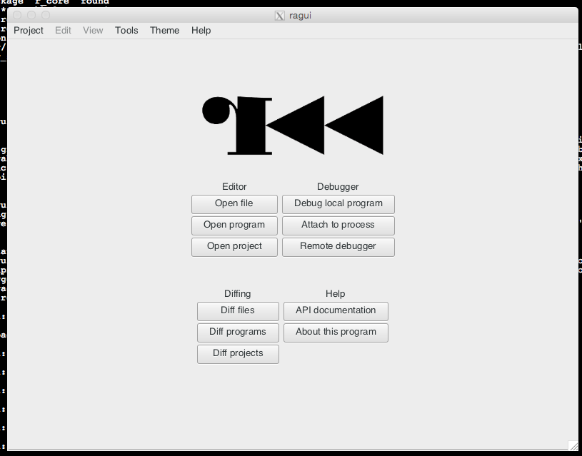

# Ragui

The RADARE GUI written in Vala / Gtk3+.

## Status

This GUI was written in 2009 for the early versions of radare2.

It is currently not working because of API changes in Vala, GTK and
Radare2. Looking forward to contributors to bring it back to live.

--pancake
